# Unreal Engine Project "Heartbeat" &ndash; Readme

* Author: Copyright 2023 Roland Bruggmann aka brugr9
* Profile on UE Marketplace: [https://www.unrealengine.com/marketplace/profile/brugr9](https://www.unrealengine.com/marketplace/profile/brugr9)
* Profile on Epic Developer Community: [https://dev.epicgames.com/community/profile/PQBq/brugr9](https://dev.epicgames.com/community/profile/PQBq/brugr9)

---


Unreal Engine Project "Heartbeat" &mdash; Heart Rate Monitoring Integration

<div style='page-break-after: always'></div>

## Description

An Unreal&reg; Engine project as proof-of-concept for receiving physiological data from Polar&reg; H10 heart rate monitor.

* Index Terms:
  * Physiological Measuring, Electrocardiogram, Heart Rate
  * Integration, Messaging, PubSub, Internet of Things, Machine to Machine
* Technology:
  * Unreal Engine, Polar H10 HR Sensor with Chest Strap, Polar Sensor Logger, Mosquitto
  * Bluetooth, USB, MQTT, JSON
  * Windows PowerShell, Chocolatey Package Manager, Android Debug Bridge, Wireshark

* Tags: UE, PolarH10, ECG, HR, HRM, PSL, ADB, BLE, USB, PubSub, MQTT, JSON, IOT, M2M

---

<div style='page-break-after: always'></div>

## Table of Contents

<!-- Start Document Outline -->

* [1. Concept](#1-concept)
* [2. Setup](#2-setup)
  * [2.1. Firewall](#21-firewall)
  * [2.2. Wireshark](#22-wireshark)
  * [2.3. Unreal Engine](#23-unreal-engine)
    * [2.3.1. Plugin MQTT](#231-plugin-mqtt)
    * [2.3.2. Demo Map and Demo Blueprint Overview](#232-demo-map-and-demo-blueprint-overview)
  * [2.4. Mosquitto](#24-mosquitto)
  * [2.5. Android Debug Bridge](#25-android-debug-bridge)
  * [2.6. Polar Sensor Logger](#26-polar-sensor-logger)
* [3. Visualisation](#3-visualisation)
  * [3.1. Messaging Startup](#31-messaging-startup)
    * [3.1.1. Heartbeat Standby](#311-heartbeat-standby)
    * [3.1.2. Heartbeat Update](#312-heartbeat-update)
  * [3.2. Messaging Teardown](#32-messaging-teardown)
* [Appendix](#appendix)
  * [Acronyms](#acronyms)
  * [Glossary](#glossary)
    * [MQTT – Quality of Service](#mqtt--quality-of-service)
    * [MQTT – Retain](#mqtt--retain)
    * [HRM – Heart Rate Variability](#hrm--heart-rate-variability)
    * [HRM – RR Interval](#hrm--rr-interval)
  * [A. References](#a-references)
  * [B. Readings](#b-readings)
  * [C. Acknowledgements](#c-acknowledgements)
  * [D. Attribution](#d-attribution)
  * [E. Disclaimer](#e-disclaimer)
  * [F. Citation](#f-citation)

<!-- End Document Outline -->

<div style='page-break-after: always'></div>

## 1. Concept

We implement a general data flow as shown in listing 1.1.

*Listing 1.1.: General Data Flow*
> **Data Producer** &mdash;(*MQTT*)&rarr; **MQTT-Broker** &mdash;(*MQTT*)&rarr; **MQTT-Client**

We use system components as follows (for the specific data flow see Listing 1.2.):

* Data Producer:
  * Polar H10 Heart Rate (HR) Sensor with Chest Strap (cp. [1])
  * Android App "Polar Sensor Logger" (PSL) (cp. [2])
* MQTT-Broker "Mosquitto" as a Windows Service (cp. [6])
* "Unreal Engine" MQTT-Client from IOT-plugin "MQTT"

*Listing 1.2.: Specific Data Flow*
> Polar H10 &ndash;(*Polar BLE SDK*)&rarr; **Polar Sensor Logger** &ndash;(*MQTT*)&rarr; **Mosquitto** &ndash;(*MQTT*)&rarr; **Unreal Engine**

The following shows the setup in reverse order of the data flow: Unreal Engine and Mosquitto on Windows&mdash;were we furthermore configure the firewall, use Wireshark adn Android Debug Bridge&mdash;and on Android we setup Polar Sensor Logger.

<div style='page-break-after: always'></div>

## 2. Setup

### 2.1. Firewall

MQTT standard port is 1883, we will use TCP as transport. In the Windows Defender Firewall allow TCP port 1883, e.g., by using an administrative PowerShell (see listing 2.1.).

*Listing 2.1.: Firewall Rule "Allow TCP Port 1883"*
```PowerShell
New-NetFirewallRule -DisplayName "Allow TCP Port 1883" -Direction inbound -Profile Any -Action Allow -LocalPort 1883 -Protocol TCP
```

### 2.2. Wireshark

We make use of Wireshark to monitor the MQTT messages sent over port 1883 (cp. [4] and [5]).

1. Launch an administrative PowerShell and install Wireshark, e.g., by using Chocolatey packet manager  (cp. [3], see listing 2.2.).
2. Startup Wireshark and filter TCP port 1883 (see listing 2.3. and figure 2.1.).

*Listing 2.2.: Use of Chocolatey to Install Wireshark*
```PowerShell
choco install wireshark
```

*Listing 2.3.: Wireshark Filter TCP Port 1883*
```
tcp.port == 1883
```


*Figure 2.1.: Wireshark Dissecting Port 1883*

<div style='page-break-after: always'></div>

### 2.3. Unreal Engine

Clone UE project "Heartbeat" using git, e.g., by ```git clone https://github.com/brugr9/Heartbeat51.git``` and startup the project.

#### 2.3.1. Plugin MQTT

The UE Heartbeat project uses the plugin "Built-In > IOT > MQTT" (see Figure 2.2.1.). Note: As of UE 5.1, the plugin is beta and not yet documented. In the "Project Settings > Plugin > MQTT"  we use the "Connection > Default URL" values Host `localhost`, Port `1883` and Scheme `MQTT`. To be able to process data from a maximum heart rate of 180 bpm resp. from 180 messages per minute, we set the "Bandwith > Publish Rate" to double (Nyquist–Shannon sampling theorem), i.e. 360 messages per minute, which corresponds to $ \frac{ 360 \text{ messages per minute}}{ 60 \text{ seconds per minute}} = 6 \text{ messages per second} $ ($ 6 \text{ Hz} $). To ensure that the transmission of MQTT meta data is also guaranteed, we round up to the next $ 10 \text{ Hz } $, i.e. `10` messages per second. (cp. figure 2.2.2.).


*Figure 2.2.1.: Unreal Engine Plugins Browser Tab with Built-in IOT Plugin "MQTT"*

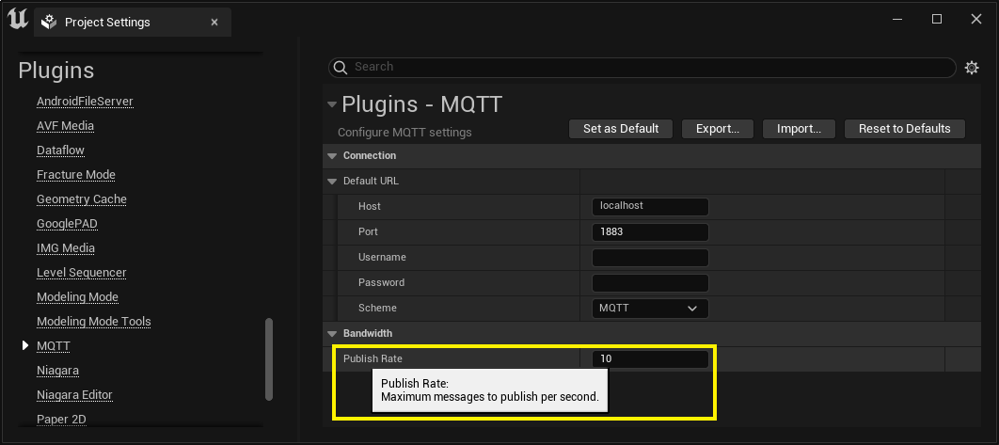
*Figure 2.2.2.: Unreal Engine Project Settings, Plugins - MQTT*

<div style='page-break-after: always'></div>

#### 2.3.2. Demo Map and Demo Blueprint Overview

Map `Map_PSL_Demo` holds a Blueprint `BP_PSL_Demo` instance and additionally a TextRenderActor instance, which is assigned to the `BP_PSL_Demo` variable `TextRender` as Object Reference (see figure 2.3.).


*Figure 2.3.: Map_PSL_Demo with instances of Blueprint BP_PSL_Demo and TextRenderActor in the Outliner and in the Viewport*

<div style='page-break-after: always'></div>

Blueprint `BP_PSL_Demo` has components and variables as follows (see figure 2.4.):

* Scene Components:
  * Static Mesh Component `HeartMesh`
* Actor Components:
  * Rotating Movement Component
  * Timeline Component `HeartbeatTimeline` (see figure 2.5.):
    * External Curve: Default Asset Curve Template `PulseOut`
    * Lenght: `1.00`
    * Looping: `on`
* Variables:
  * String `MyTopic`, default value set to `psl/hr`
  * MQTT-Client Object Reference `MyClient`
  * MQTT-Subscription Object Reference `MySubscription`
  * TextRenderActor Object Reference `TextRender` (public)
  * Timer Handle `TextRenderVisibilityTimer`


*Figure 2.4.: Blueprint BP_PSL_Demo, Variable TextRender*

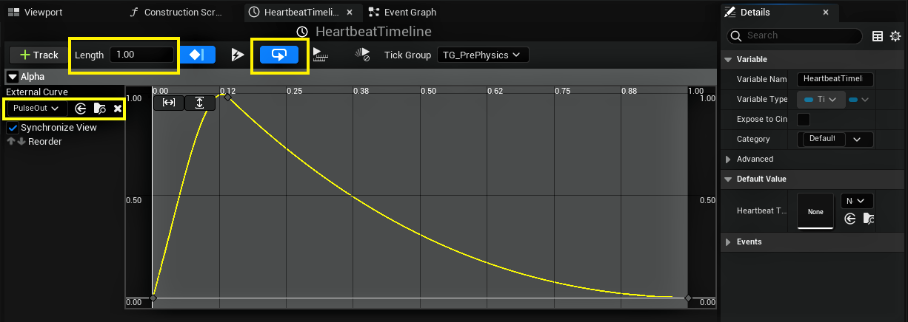
*Figure 2.5.: Blueprint BP_PSL_Demo, Timeline Component HeartbeatTimeline*

<div style='page-break-after: always'></div>

Blueprint `BP_PSL_Demo` has events as follows (see figure 2.6.):

* Gameplay: `EventBeginPlay`, `EventEndPlay`
* Messaging: `OnConnect`, `OnDisconnect`, `OnMessage`
* Visualisation:
  * Main: `HeartbeatStandby`, `HeartbeatUpdate`, `HeartbeatDeactivate`
  * Helpers: `TextRenderBlink`, `HeartbeatReset`
* Testing: `Testing01`, `Testing02`, `Testing03`

Blueprint `BP_PSL_Demo` has Event Graph sections as follows (see figure 2.6.):

* 'Startup Messaging' (color green, cp. section 3.1.)
* 'Teardown Messaging' (color violet, cp. section 3.2.)
* 'Testing' (color yellow, not documented here)
* 'Heartbeat' (color red, cp. section 3.1. and 3.2.)

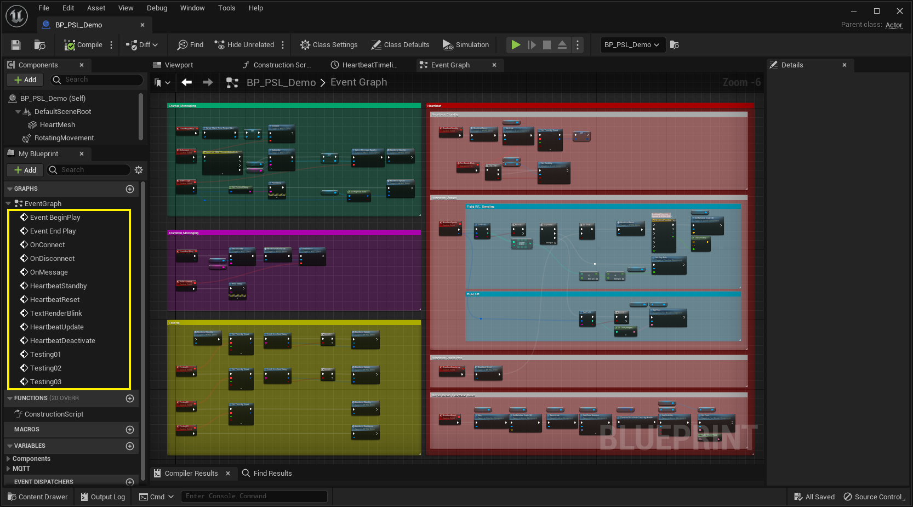
*Figure 2.6.: Blueprint BP_PSL_Demo, Event Graph Overview*

<div style='page-break-after: always'></div>

### 2.4. Mosquitto

Install Mosquitto MQTT-Broker (cp. [6]) and start the Windows Service "Mosquitto Broker" (see figure 2.9.).


*Figure 2.9.: Mosquitto Broker as Windows Service*

### 2.5. Android Debug Bridge

On the Android device enable USB Debugging mode (cp. [7]):

> 1. Launch the `Settings` application.
> 2. Tap the `About Phone` option (generally found near the bottom of the list).
> 3. Then tap the `Build Number` option *7 times* to enable *Developer Mode*. You will see a toast message when it is done.
> 4. Now go back to the main `Settings` screen and you should see a new `Developer Options` menu you can access.
> 5. Go in there and enable the `USB Debugging` mode option.
> 6. Connect the Android device to the PC by USB cable.

On the PC using an administrative PowerShell setup "Android Debug Bridge" ADB (cp. [7]):

1. Install "Android Debug Bridge", e.g., by using Chocolatey packet manager (cp. [3], see listing 2.4.)
2. Startup the "Android Debug Bridge" with mapping TCP port 1883 bidirectional (cp. [8], see listing 2.5.)

Back on the Andorid, a prompt "Allow USB Debugging" is shown, accept by hitting `OK`

*Listing 2.4.: Use of Chocolatey to Install Android Debug Bridge*
```PowerShell
choco install adb
```

*Listing 2.5.: Android Debug Bridge Startup*
```PowerShell
adb reverse tcp:1883 tcp:1883
```

<div style='page-break-after: always'></div>

### 2.6. Polar Sensor Logger

Mount the Polar H10 sensor on the chest strap and wear the same. On the Android device ...

1. Install the "Polar Sensor Logger" App (cp. [2])
2. Activate Bluetooth
3. Activate Location Service
4. Launch the "Polar Sensor Logger" App, in the main tab configure as follows:
   1. "SDK data select:" check `ECG` solely (cp. figure 2.10.).
   2. "Settings:" check `MQTT` solely (cp. figure 2.10.).
      * In the pop-up "MQTT-serttings" configure (cp. figure 2.11.):
         * MQTT-broker address: `127.0.0.1`
         * Port: `1883`
         * Topic: `psl`
         * Client ID: e.g. `MyPSL-01`
      * Hit `OK`
   3. Hit `SEEK SENSOR`
      * Select listed sensor `Polar H10 12345678` (ID will differ) (cp. figure 2.12.)
      * Hit `OK`

|  |  |  | 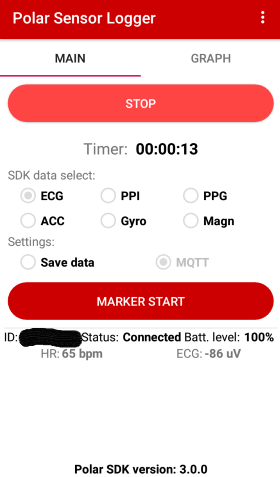 |
|:-------------------------:|:-------------------------:|:-------------------------:|:-------------------------:|
| *Figure 2.10.: PSL, Main Tab* | *Figure 2.11.: PSL, Dialogue "MQTT Settings"* | *Figure 2.12.: PSL, Dialogue "Seek Sensor"* | *Figure 2.13.: PSL, Main Tab, Connected* |

<div style='page-break-after: always'></div>

With Polar Sensor Logger main tab entry "SDK data select" option *ECG* activated, PSL publishes two topics:

* Topic `psl/ecg` (cp. listing 2.6.): delivers a JSON-Object as payload containing, among others
  * a JSON-Field named `"ecg": [ ... ]`, a JSON-Array of ECG values in microvolts [uV]
* Topic `psl/hr` (cp. listing 2.7.): delivers a JSON-Object as payload containing, among others
  * a JSON-Field ```"hr": 64``` containing a JSON-Integer which corresponds to the heart rate in beats per minute (bpm)
  * a JSON-Field ```"rr": [ 938 ]``` containing a JSON-Array of RR intervals in milliseconds [ms]

We subscribe to the latter topic only.

*Listing 2.6.: Topic psl/ecg, example JSON-Object Payload*
```json
{
  "clientId": "MyPSL-01",
  "deviceId": "12345678",
  "sessionId": 1234567890,
  "sampleRate": 130,
  "timeStamp": 1234567890123,
  "sensorTimeStamp": 123456789012345678,
  "ecg": [
    -91,
    -91,
    -103,
    -117,
    ...
  ]
}
```

*Listing 2.7.: Topic psl/hr, example JSON-Object Payload*
```json
{
  "clientId": "MyPSL-01",
  "deviceId": "12345678",
  "sessionId": 1234567890,
  "timeStamp": 1234567890123,
  "hr": 64,
  "rr": [
    938
  ]
}
```

<div style='page-break-after: always'></div>

## 3. Visualisation

In Unreal Editor with Level `Map_PSL_Demo` open, click the `Play` button &#9658; in the level editor to start Play-in-Editor (PIE) (see listing 3.1.).

*Listing 3.1.: Output Log of Map_PSL_Demo starting PIE*
```
[...]
LogWorld: Bringing World /Game/UEDPIE_0_Map_PSL_Demo.Map_PSL_Demo up for play (max tick rate 0)
LogWorld: Bringing up level for play took: 0.000950
LogOnline: OSS: Created online subsystem instance for: :Context_6
[...]
PIE: Server logged in
PIE: Play in editor total start time 0.132 seconds.
[...]
```

### 3.1. Messaging Startup

On `EventBeginPlay` an MQTT-Client is created and connected (see figure 3.1.). The MQTT-Plugin writes to the output log with custom log category `LogMQTTCore` (see listing 3.2.). Wireshark dissecting port 1883 lists, e.g., the `Connect Command` sent from the UE MQTT-Client (see figure 3.2.).

With event `OnConnect` &ndash; if the connection was accepted &ndash; the topic is subscribed and event `HeartbeatStandby` is called (cp. section 3.1.1.). With event `OnMessage` the received message is evaluated by calling event `HeartbeatUpdate` (cp. section 3.1.2.).

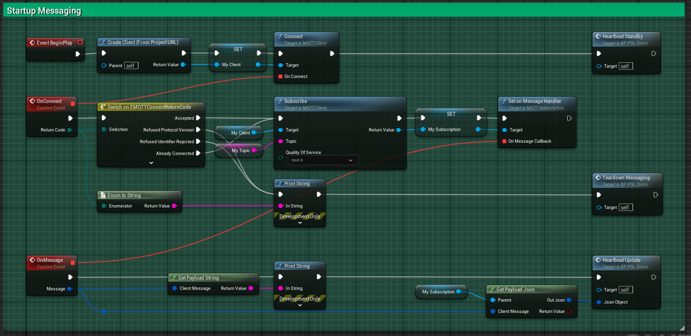
*Figure 3.1.: Blueprint BP_PSL_Demo, Event Graph Section 'Startup Messaging'*

<div style='page-break-after: always'></div>

*Listing 3.2.: Output Log of Map_PSL_Demo starting PIE*
```
[...]
LogMQTTCore: VeryVerbose: Created MQTTConnection for 127.0.0.1
LogMQTTCore: Display: Created new Client, Num: 1
LogMQTTCore: Verbose: Set State to: Connecting
LogMQTTCore: Verbose: Queued Subscribe message with PacketId 1., and Topic Filter: 'psl/hr'
[...]
LogMQTTCore: Verbose: Copy outgoing operations to buffer
LogMQTTCore: Verbose: Operations deferred: 2
LogMQTTCore: Verbose: Processing incoming packets of size: 4
LogMQTTCore: Verbose: Set State to: Connected
LogMQTTCore: VeryVerbose: Handled ConnectAck message.
LogMQTTCore: Verbose: Copy outgoing operations to buffer
LogMQTTCore: Verbose: Operations deferred: 0
LogMQTTCore: Verbose: Processing incoming packets of size: 5
LogMQTTCore: VeryVerbose: Handled SubscribeAck message with PacketId 1.
LogMQTTCore: Verbose: Processing incoming packets of size: 2
LogMQTTCore: VeryVerbose: Handled PingResponse message.
LogMQTTCore: Verbose: Copy outgoing operations to buffer
LogMQTTCore: Verbose: Operations deferred: 0
LogMQTTCore: Verbose: Copy outgoing operations to buffer
LogMQTTCore: Verbose: Operations deferred: 0
[...]
```


*Figure 3.2.: Wireshark Dissecting Port 1883, Connect Command from Unreal Engine MQTT Client Instance*

<div style='page-break-after: always'></div>

#### 3.1.1. Heartbeat Standby

With event `OnConnect` the topic is subscribed and event `HeartbeatStandby` is called, which starts a visual feedback (see figure 3.3.): The `RotatingMovement` is activated and the `TextRenderVisibilityTimer` is started `looping` within `0.5` seconds calling event `TextRenderBlink` which switches the `TextRender` visibility on and off by a `FlipFlop`.

As result the Mesh Component `HeartMesh` rotates and the TextRenderActor `TextRender` is blinking (see figures 3.4.1. and 3.4.2.).

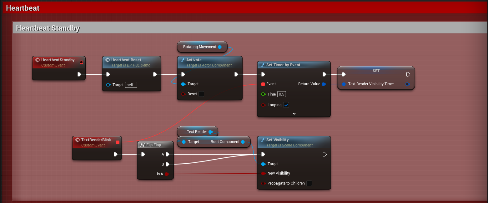
*Figure 3.3.: Blueprint BP_PSL_Demo, Event Graph Section 'Heartbeat Standby'*

| 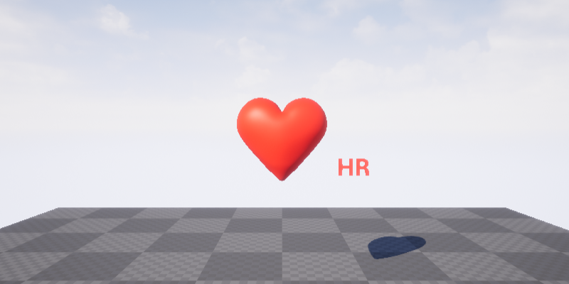 |  | 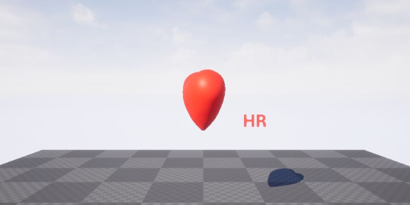 | 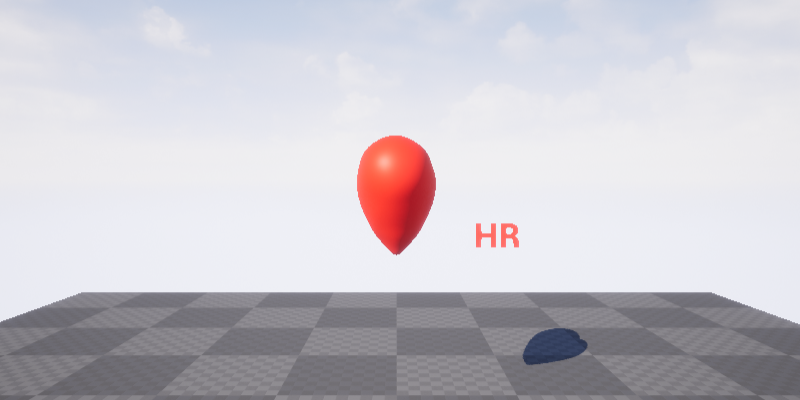 |  | 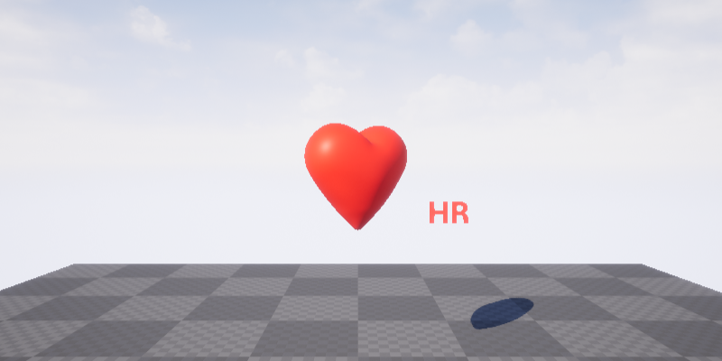 |
|:----------:|:----------:|:----------:|:----------:|:----------:|:----------:|
*Figure 3.4.1.: Screenshots of Map_PSL_Demo PIE, Heartbeat Standby*


*Figure 3.4.2.: Animation Screenshot of Map_PSL_Demo PIE, Heartbeat Standby*

<div style='page-break-after: always'></div>

#### 3.1.2. Heartbeat Update

With event `OnMessage` the received message payload is evaluated by calling event `HeartbeatUpdate`, which updates the visual feedback (see figure 3.5.): The RR interval from JSON-Field `rr` in Milliseconds [ms] is converted to [Hz] and is set as `HeartbeatTimeline` play rate. The HR value from JSON-Field `hr` is set to `TextRender`.

As result the Mesh-Component `HeartMesh` bumps frequently as given by RR interval and the TextRenderActor `TextRender` shows the heart rate (see figures 3.6.1. and 3.6.2.).

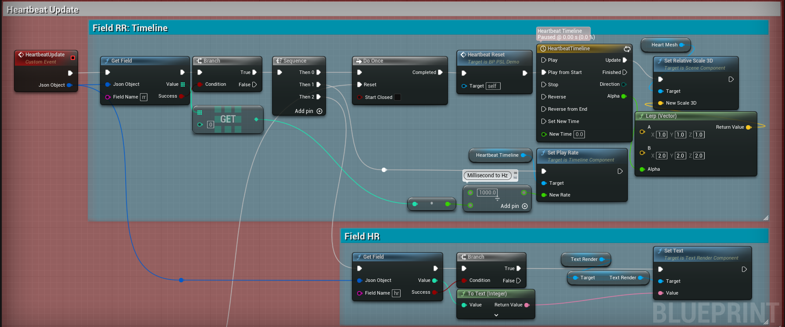
*Figure 3.5.: Blueprint BP_PSL_Demo, Event Graph Section 'Heartbeat Update'*

|  |  |  | 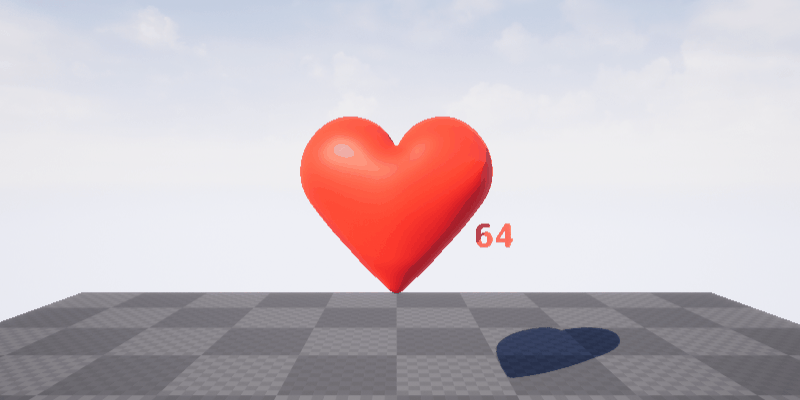 | 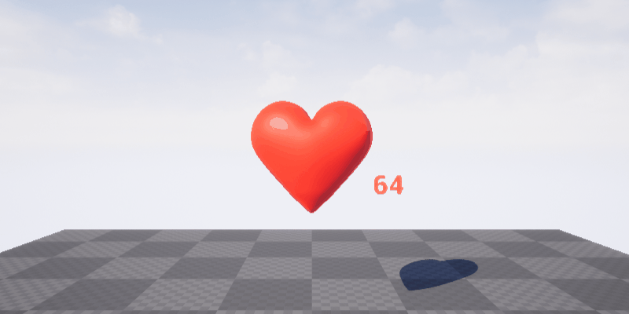 |  |
|:----------:|:----------:|:----------:|:----------:|:----------:|:----------:|
*Figure 3.6.1.: Screenshots of Map_PSL_Demo PIE, Heartbeat Update*


*Figure 3.6.2.: Animation Screenshot of Map_PSL_Demo PIE, Heartbeat Update*

<div style='page-break-after: always'></div>

With event `OnMessage` the received message payload is printed to output log (see listing 3.3.).

*Listing 3.3.: Output Log of Map_PSL_Demo running PIE and logging the received Payloads*
```
[...]
LogMQTTCore: Verbose: Processing incoming packets of size: 157
LogMQTTCore: VeryVerbose: Handled Publish message.
LogBlueprintUserMessages: [BP_PSL_Demo_C_1] {
  "clientId": "MyPSL-01",
  "deviceId": "12345678",
  "sessionId": 1234567890,
  "timeStamp": 1234567890123,
  "hr": 64,
  "rr": [
    938
  ]
LogMQTTCore: Verbose: Processing incoming packets of size: 157
LogMQTTCore: VeryVerbose: Handled Publish message.
LogBlueprintUserMessages: [BP_PSL_Demo_C_1] {
  "clientId": "MyPSL-01",
  "deviceId": "12345678",
  "sessionId": 1234567890,
  "timeStamp": 1235678901234,
  "hr": 124,
  "rr": [
    484
  ]
[...]
```

<div style='page-break-after: always'></div>

### 3.2. Messaging Teardown

With stopping PIE, on `EventEndPlay` the topic is unsubscribed (see figure 3.7.). With event `HeartbeatDeactivate` the Mesh Component `HeartMesh` and the TextRenderActor animation is stopped and reset (see figure 3.8.). Then the MQTT-Client disconnects, `OnDisconnect` a message is printed to the output log (see listing 3.4.).


*Figure 3.7.: Blueprint BP_PSL_Demo, Event Graph Section 'Teardown'*

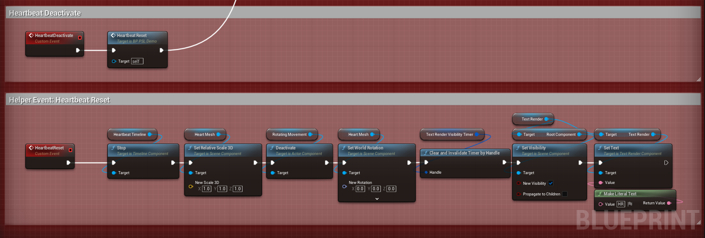
*Figure 3.8.: Blueprint BP_PSL_Demo, Event Graph Section 'Heartbeat Deactivate'*

*Listing 3.4.: Output Log of Map_PSL_Demo stopping PIE*
```
[...]
LogWorld: BeginTearingDown for /Game/UEDPIE_0_Map_PSL_Demo
LogMQTTCore: Verbose: Set State to: Disconnecting
[...]
LogMQTTCore: Verbose: Copy outgoing operations to buffer
LogMQTTCore: Verbose: Operations deferred: 1
LogMQTTCore: Verbose: Set State to: Disconnected
[...]
LogMQTTCore: Verbose: Set State to: Stopping
LogMQTTCore: Verbose: Abandoning Operations
LogMQTTCore: Verbose: Abandoning Operations
LogMQTTCore: VeryVerbose: Destroyed MQTTConnection at 127.0.0.1
[...]
```

<div style='page-break-after: always'></div>

## Appendix

### Acronyms

* ADB &mdash; Android Debug Bridge
* BLE &mdash; Bluetooth Low Energy
* bpm &mdash; Beats per Minute
* ECG &mdash; Electrocardiogram
* HR &mdash; Heart Rate
* HRM &mdash; Heart Rate Monitor
* HRV &mdash; Heart Rate Variability
* IBI &mdash; Interbeat Interval
* IOT &mdash; Internet of Things
* JSON &mdash; JavaScript Object Notation
* M2M &mdash; Machine to Machine
* MQTT &mdash; Message Queuing Telemetry Transport
* PIE &mdash; Play-in-Editor
* PoC &mdash; Proof-of-Concept
* PS &mdash; PowerShell
* PSL &mdash; Polar Sensor Logger
* QoS &mdash; Quality of Service
* RRI &mdash; RR Interval
* UE &mdash; Unreal Engine
* USB &mdash; Universal Serial Bus

<div style='page-break-after: always'></div>

### Glossary

#### MQTT &ndash; Quality of Service

> *The Quality of Service (QoS) level is an agreement between the sender of a message and the receiver of a message that defines the guarantee of delivery for a specific message. There are 3 QoS levels in MQTT:*
>
> * *At most once (0)*
> * *At least once (1)*
> * *Exactly once (2)*
>
> *When you talk about QoS in MQTT, you need to consider the two sides of message delivery:*
>
> * *Message delivery form the publishing client to the broker.*
> * *Message delivery from the broker to the subscribing client.*
>
> *We will look at the two sides of the message delivery separately because there are subtle differences between the two. The client that publishes the message to the broker defines the QoS level of the message when it sends the message to the broker. The broker transmits this message to subscribing clients using the QoS level that each subscribing client defines during the subscription process. If the subscribing client defines a lower QoS than the publishing client, the broker transmits the message with the lower quality of service.*
(HiveMQ, cp. [9.1])

#### MQTT &ndash; Retain

> *A retained message is a normal MQTT message with the retained flag set to true. The broker stores the last retained message and the corresponding QoS for that topic. Each client that subscribes to a topic pattern that matches the topic of the retained message receives the retained message immediately after they subscribe. The broker stores only one retained message per topic.*
(HiveMQ, cp. [9.2])

#### HRM &ndash; Heart Rate Variability

In a healthy person, the heart does not beat with a fixed frequency, i.e. with a resting pulse of, for example, 60 heartbeats per minute, each beat does not occur after exactly one second or 1000 milliseconds. Fluctuations of 30 to 100 milliseconds in the heartbeat sequence occur as a natural mode of operation of the heart.

> *Heart rate variability (HRV) is the amount by which the time interval between successive heartbeats (interbeat interval, IBI) varies from beat to beat. The magnitude of this variability is small (measured in milliseconds), and therefore, assessment of HRV requires specialized measurement devices and accurate analysis tools. Typically HRV is extracted from an electrocardiogram (ECG) measurement by measuring the time intervals between successive heartbeats [...].*
*Heart rate variability in healthy individuals is strongest during rest, whereas during stress and physical activity HRV is decreased. The magnitude of heart rate variability is different between individuals. High HRV is commonly linked to young age, good physical fitness, and good overall health.*
(Kubios, cp. [10]).

#### HRM &ndash; RR Interval

The RR interval RRI is an interbeat interval IBI, more precisely the time elapsed between two successive R-waves of the QRS signal on the electrocardiogram, in milliseconds [ms] (cp. [11] and [12]).

<div style='page-break-after: always'></div>

### A. References

* [1] Polar Electro: **Polar H10**. Heart Rate Sensor with Chest Strap, Online: [https://www.polar.com/en/sensors/h10-heart-rate-sensor](https://www.polar.com/en/sensors/h10-heart-rate-sensor)
* [2] Jukka Happonen: **Polar Sensor Logger**. App on Google Play, Online: [https://play.google.com/store/apps/details?id=com.j_ware.polarsensorlogger](https://play.google.com/store/apps/details?id=com.j_ware.polarsensorlogger)
* [3] **Chocolatey** &ndash; The Package Manager for Windows. Online: [https://chocolatey.org/](https://chocolatey.org/)
* [4] Abhinaya Balaji: **Dissecting MQTT using Wireshark**. In: Blog Post, July 6, 2017. Catchpoint Systems, Inc. Online: [https://www.catchpoint.com/blog/wireshark-mqtt](https://www.catchpoint.com/blog/wireshark-mqtt)
* [5] Wireshark Documentation: **Display Filter Reference: MQ Telemetry Transport Protocol**, Online: [https://www.wireshark.org/docs/dfref/m/mqtt.html](https://www.wireshark.org/docs/dfref/m/mqtt.html)
* [6] **Eclipse Mosquitto** &ndash; An open source MQTT broker. Online: [https://mosquitto.org/](https://mosquitto.org/)
* [7] Skanda Hazarika: **How to Install ADB on Windows, macOS, and Linux**. July 28, 2021. In: XDA Developers. Online: [https://www.xda-developers.com/install-adb-windows-macos-linux](https://www.xda-developers.com/install-adb-windows-macos-linux)
* [8] Tushar Sadhwani: **Connecting Android Apps to localhost, Simplified**. April 17, 2021. In: DEV Community, Online: [https://dev.to/tusharsadhwani/connecting-android-apps-to-localhost-simplified-57lm](https://dev.to/tusharsadhwani/connecting-android-apps-to-localhost-simplified-57lm)
* [9.1] HiveMQ Team: **Quality of Service (QoS) 0,1, & 2 MQTT Essentials: Part 6**. February 16, 2015. Online: [https://www.hivemq.com/blog/mqtt-essentials-part-6-mqtt-quality-of-service-levels/](https://www.hivemq.com/blog/mqtt-essentials-part-6-mqtt-quality-of-service-levels/)
* [9.2] HiveMQ Team: **Retained Messages - MQTT Essentials: Part 8**. March 2, 2015. Online: [https://www.hivemq.com/blog/mqtt-essentials-part-8-retained-messages/](https://www.hivemq.com/blog/mqtt-essentials-part-8-retained-messages/)
* [10] **Heart Rate Variability**. In: Website of Kubios Oy, Section "HRV Resources". Online: [https://www.kubios.com/about-hrv/](https://www.kubios.com/about-hrv/)
* [11]  **RR Interval**. In: ScienceDirect. From: Principles and Practice of Sleep Medicine (Fifth Edition), 2011. Online: [https://www.sciencedirect.com/topics/nursing-and-health-professions/RR-interval](https://www.sciencedirect.com/topics/nursing-and-health-professions/RR-interval)
* [12] Mike Cadogan: **R wave Overview**. February 4, 2021. In: Live In The Fastlane &ndash; ECG Library, ECG Basics. Online: [https://litfl.com/r-wave-ecg-library/](https://litfl.com/r-wave-ecg-library/)

### B. Readings

* Ch&#281;&cacute;, A.; Olczak, D.; Fernandes, T. and Ferreira, H. (2015). **Physiological Computing Gaming - Use of Electrocardiogram as an Input for Video Gaming**. In: Proceedings of the 2nd International Conference on Physiological Computing Systems - PhyCS, ISBN 978-989-758-085-7; ISSN 2184-321X, pages 157-163. DOI: [10.5220/0005244401570163](http://dx.doi.org/10.5220/0005244401570163)

### C. Acknowledgements

* Logo: "**A red heart with a heartbeat to the right**", by Diego Naive / Joe Sutherland, June 6, 2018. Online: [https://de.wikipedia.org/wiki/Datei:Red_heart_with_heartbeat_logo.svg](https://de.wikipedia.org/wiki/Datei:Red_heart_with_heartbeat_logo.svg), licensed [CC BY 4.0](http://creativecommons.org/licenses/by/4.0/).
* 3D Model: "**Heart**", by phenopeia, January 16, 2015. Online: [https://skfb.ly/CCyL](https://skfb.ly/CCyL), licensed [CC BY 4.0](http://creativecommons.org/licenses/by/4.0/).

<div style='page-break-after: always'></div>

### D. Attribution

* The word mark Unreal and its logo are Epic Games, Inc. trademarks or registered trademarks in the US and elsewhere.
* The word mark Polar and its logos are trademarks of Polar Electro Oy.
* Android is a trademark of Google LLC.
* The Bluetooth word mark and logos are registered trademarks owned by Bluetooth SIG, Inc.
* Windows and PowerShell are registered trademarks of Microsoft Corporation.
* The Chocolatey package manager software and logo are trade marks of Chocolatey Software, Inc.
* Mosquitto is a registered trade mark of the Eclipse Foundation.
* Wireshark and the "fin" logo are registered trademarks of the Wireshark Foundation.

### E. Disclaimer

This documentation has **not been reviewed or approved** by the *Food and Drug Administration FDA* or by any other agency. It is the users responsibility to ensure compliance with applicable rules and regulations&mdash;be it in the US or elsewhere.

### F. Citation

To acknowledge this work, please cite

> Bruggmann, R. (2023): Unreal&reg; Engine Project "Heartbeat" [Computer software], Version v5.1.0. Licensed under Creative Commons Attribution-ShareAlike 4.0 International. Online: https://github.com/brugr9/heartbeat51

```bibtex
@software{Bruggmann_Heartbeat_2023,
  author = {Bruggmann, Roland},
  year = {2023},
  version = {v5.1.0},
  title = {{Unreal Engine Project 'Heartbeat'}},
  url = {https://github.com/brugr9/heartbeat51}
}
```

---
<!-- Footer -->

[](https://creativecommons.org/licenses/by-sa/4.0/)

*Unreal&reg; Engine Project "Heartbeat"* &copy; 2023 by [Roland Bruggmann](https://about.me/rbruggmann) is licensed under [Creative Commons Attribution-ShareAlike 4.0 International](http://creativecommons.org/licenses/by-sa/4.0/)
