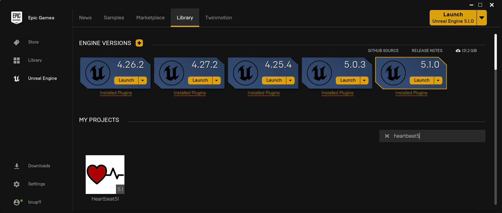
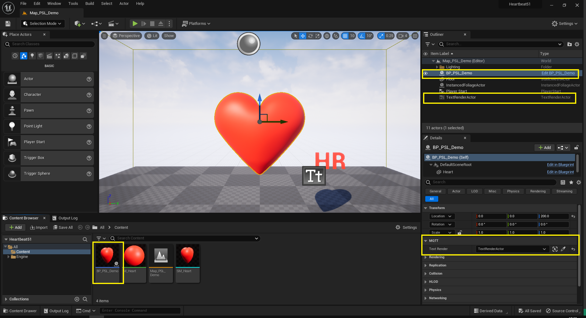
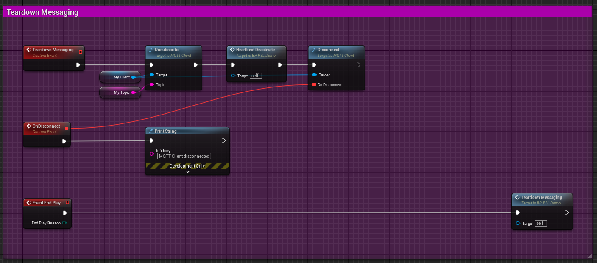
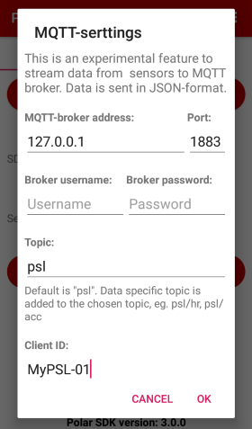
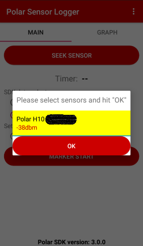

# Unreal Engine Project "Heartbeat" &ndash; Readme

* Author: Copyright 2023 Roland Bruggmann aka brugr9
* Profile on UE Marketplace: [https://www.unrealengine.com/marketplace/profile/brugr9](https://www.unrealengine.com/marketplace/profile/brugr9)
* Profile on Epic Developer Community: [https://dev.epicgames.com/community/profile/PQBq/brugr9](https://dev.epicgames.com/community/profile/PQBq/brugr9)

---



Unreal Engine Project "Heartbeat" &mdash; Heart Rate Monitoring Integration

## Description

An Unreal&reg; Engine project as proof-of-concept for receiving physiological data from Polar&reg; H10 heart rate monitor.

* Index Terms:
  * Physiological Measuring, Electrocardiogram, Heart Rate
  * Integration, Messaging, Internet of Things, Machine to Machine
* Technology:
  * Unreal Engine, Polar H10 HR Sensor with Chest Strap, Polar Sensor Logger
  * Bluetooth, USB, MQTT, JSON
  * Android Debug Bridge, Mosquitto, Wireshark
  * Windows PowerShell, Chocolatey Package Manager

* Tags: ECG, HR, IOT, M2M, UE, PolarH10, PSL, ADB, BLE, USB, MQTT, JSON

---

<div style='page-break-after: always'></div>

## Table of Contents

<!-- Start Document Outline -->

* [1. Concept](#1-concept)
* [2. Setup](#2-setup)
  * [2.1. Firewall](#21-firewall)
  * [2.2. Wireshark](#22-wireshark)
  * [2.3. Unreal Engine](#23-unreal-engine)
  * [2.4. Mosquitto](#24-mosquitto)
  * [2.5. Android Debug Bridge](#25-android-debug-bridge)
  * [2.6. Polar Sensor Logger](#26-polar-sensor-logger)
* [3. Visualisation](#3-visualisation)
* [Appendix](#appendix)
  * [Acronyms](#acronyms)
  * [Glossary](#glossary)
  * [A. References](#a-references)
  * [B. Readings](#b-readings)
  * [C. Acknowledgements](#c-acknowledgements)
  * [D. Attribution](#d-attribution)
  * [E. Disclaimer](#e-disclaimer)
  * [F. Citation](#f-citation)

<!-- End Document Outline -->

<div style='page-break-after: always'></div>

## 1. Concept

We implement a general data flow as shown in listing 1.1.

*Listing 1.1.: General Data Flow*
> **Data Producer** &mdash;(*MQTT*)&rarr; **MQTT-Broker** &mdash;(*MQTT*)&rarr; **MQTT-Client**

We use system components as follows (for the specific data flow see Listing 1.2.):

* Data Producer:
  * Polar H10 Heart Rate (HR) Sensor with Chest Strap (cp. [1])
  * Android App "Polar Sensor Logger" (PSL) (cp. [2])
* MQTT-Broker "Mosquitto" as a Windows Service (cp. [6])
* "Unreal Engine" MQTT-Client from IOT-plugin "MQTT"

*Listing 1.2.: Specific Data Flow*
> Polar H10 &ndash;(*Polar BLE SDK*)&rarr; **Polar Sensor Logger** &ndash;(*MQTT*)&rarr; **Mosquitto** &ndash;(*MQTT*)&rarr; **Unreal Engine**

The following shows the setup in reverse order of the data flow: Unreal Engine and Mosquitto on Windows&mdash;were we furthermore use Wireshark and Android Debug Bridge&mdash;and Polar Sensor Logger on Android.

<div style='page-break-after: always'></div>

## 2. Setup

### 2.1. Firewall

MQTT standard port is 1883, we will use TCP as transport. In the Windows Defender Firewall allow TCP port 1883, e.g., by using an administrative PowerShell (see listing 2.1.).

*Listing 2.1.: Firewall Rule "Allow TCP Port 1883"*
```PowerShell
New-NetFirewallRule -DisplayName "Allow TCP Port 1883" -Direction inbound -Profile Any -Action Allow -LocalPort 1883 -Protocol TCP
```

### 2.2. Wireshark

We make use of Wireshark to monitor the MQTT messages sent over port 1883 (cp. [4] and [5]).

1. Launch an administrative PowerShell and install Wireshark, e.g., by using Chocolatey packet manager  (cp. [3], see listing 2.2.).
2. Startup Wireshark and filter TCP port 1883 (see listing 2.3. and figure 2.1.).

*Listing 2.2.: Use of Chocolatey to Install Wireshark*
```PowerShell
choco install wireshark
```

*Listing 2.3.: Wireshark Filter TCP Port 1883*
```
tcp.port == 1883
```


*Figure 2.1.: Wireshark Dissecting Port 1883*

<div style='page-break-after: always'></div>

### 2.3. Unreal Engine

Clone UE project "Heartbeat" using git, e.g., by ```git clone https://github.com/brugr9/Heartbeat51.git``` and startup the project.

#### 2.3.1. Plugin MQTT

UE project "Heartbeat" makes use of built-in IOT plugin "MQTT" (see figure 2.2.). Note: With UE 5.1 as of January 2023, the plugin is not yet documented.


*Figure 2.2.: Unreal Engine Plugins Browser Tab with Built-in IOT Plugin "MQTT"*

#### 2.3.2. MQTT Subscription

Map `Map_PSL_Demo` holds a Blueprint `BP_PSL_Demo` instance and additionally a TextRenderActor instance, which is assigned to the `BP_PSL_Demo` variable 'TextRender' as Object Reference (see figure 2.3.).


*Figure 2.3.: Map_PSL_Demo with BP_PSL_Demo and TextRenderActor in the Outliner and in the Viewport*

<div style='page-break-after: always'></div>

Blueprint `BP_PSL_Demo` has components as follows (see figure 2.4.):

* Scene Components:
  * Static Mesh Component `Heart`
* Actor Components:
  * Rotating Movement Component
  * Timeline Component `HeartbeatTimeline`

Blueprint `BP_PSL_Demo` has variables as follows (see figure 2.4.):

* String `MyTopic`, default value set to `psl/hr`
* MQTT-Client Object Reference `MyClient`
* MQTT-Subscription Object Reference `MySubscription`
* TextRenderActor Object Reference `TextRender` (public)


*Figure 2.4.: BP_PSL_Demo, Variable TextRender*

<div style='page-break-after: always'></div>

Blueprint `BP_PSL_Demo` has events as follows (see figure 2.5.):

* EventBeginPlay, EventEndPlay
* OnConnect, OnDisconnect, OnMessage
* HeartbeatStandby, HeartbeatUpdate, HeartbeatDeactivate
* TextRenderBlink, HeartbeatReset


*Figure 2.5.: BP_PSL_Demo, Event Graph Overview*

<div style='page-break-after: always'></div>

##### 2.3.2.1. Messaging Startup

On `EventBeginPlay` an MQTT-Client is crated and connected, with `HeartbeatStandby` the HeartMesh starts rotating and the TextRenderActor starts blinking. `OnConnect`, if the connection was accepted, the topic is subscribed. `OnMessage` the received MQTT-Client-Message payload is evaluated by calling `HeartbeatUpdate` (see figure 2.6.).


*Figure 2.6.: BP_PSL_Demo, Event Graph with Startup*

##### 2.3.2.2. Messaging Teardown

On `EventEndPlay` the topic is unsubscribed and the MQTT-Client is disconnected (see figure 2.7.).


*Figure 2.7.: BP_PSL_Demo, Event Graph with Teardown*

<div style='page-break-after: always'></div>

### 2.4. Mosquitto

Install Mosquitto MQTT-Broker (cp. [6]) and start the Windows Service "Mosquitto Broker" (see figure 2.8.).


*Figure 2.8.: Mosquitto Broker as Windows Service*

<div style='page-break-after: always'></div>

### 2.5. Android Debug Bridge

On the Android device enable USB Debugging mode (cp. [7]):

> 1. Launch the `Settings` application.
> 2. Tap the `About Phone` option (generally found near the bottom of the list).
> 3. Then tap the `Build Number` option *7 times* to enable *Developer Mode*. You will see a toast message when it is done.
> 4. Now go back to the main `Settings` screen and you should see a new `Developer Options` menu you can access.
> 5. Go in there and enable the `USB Debugging` mode option.
> 6. Connect the Android device to the PC by USB cable.

On the PC setup "Android Debug Bridge" ADB (cp. [7]):

1. Launch an administrative PowerShell
   1. Install "Android Debug Bridge", e.g., by using Chocolatey packet manager (cp. [3], see listing 2.4.)
   2. Startup the "Android Debug Bridge" with mapping TCP port 1883 bidirectional (cp. [8], see listing 2.5. and listing 2.6.)
2. Back on the Andorid, a prompt "Allow USB Debugging" is shown, accept by hitting `OK`

*Listing 2.4.: Use of Chocolatey to Install Android Debug Bridge*
```PowerShell
choco install adb
```

*Listing 2.5.: Android Debug Bridge Startup*
```PowerShell
adb reverse tcp:1883 tcp:1883
```

*Listing 2.6.: Android Debug Bridge Feedback*
```PowerShell
* daemon not running; starting now at tcp:5037
* daemon started successfully
```

<div style='page-break-after: always'></div>

### 2.6. Polar Sensor Logger

Mount the Polar H10 sensor on the chest strap and wear the same. On the Android device ...

1. Install the "Polar Sensor Logger" App (cp. [2])
2. Activate Bluetooth
3. Activate Location Service
4. Launch the "Polar Sensor Logger" App, in the main tab configure as follows:
   1. "SDK data select:" check `ECG` solely (cp. figure 2.9.).
   2. "Settings:" check `MQTT` solely (cp. figure 2.9.).
      * In the pop-up "MQTT-serttings" configure (cp. figure 2.10.):
         * MQTT-broker address: `127.0.0.1`
         * Port: `1883`
         * Topic: `psl`
         * Client ID: e.g. `MyPSL-01`
      * Hit `OK`
   3. Hit `SEEK SENSOR`
      * Select listed sensor `Polar H10 12345678` (ID will differ) (cp. figure 2.11.)
      * Hit `OK`

 |  | 
:-------------------------:|:-------------------------:|:-------------------------:
*Figure 2.9.: PSL, Main Tab* | *Figure 2.10.: PSL, Dialogue "MQTT Settings"* | *Figure 2.11.: PSL, Dialogue "Seek Sensor"*

<div style='page-break-after: always'></div>

With Polar Sensor Logger "SDK data select", *ECG* activated, two topics are delivered: `psl/ecg` (cp. listing 2.7.) and `psl/hr` (cp. listing 2.8.). We consume the latter only, where ```"hr": 64``` corresponds to the heart rate in Beats per Minute (BPM) and ```"rr": [ 833 ]``` corresponds to the R-R interval in Milliseconds.

*Listing 2.7.: Topic psl/ecg, example Payload in JSON*
```json
{
  "clientId": "MyPSL-01",
  "deviceId": "12345678",
  "sessionId": 1234567890,
  "sampleRate": 130,
  "timeStamp": 1234567890123,
  "sensorTimeStamp": 123456789012345678,
  "ecg": [
    -91,
    -91,
    -103,
    -117,
    -117
  ]
}
```

*Listing 2.8.: Topic psl/hr, example Payload in JSON*
```json
{
  "clientId": "MyPSL-01",
  "deviceId": "12345678",
  "sessionId": 1234567890,
  "timeStamp": 1234567890123,
  "hr": 64,
  "rr": [
    833
  ]
}
```

<div style='page-break-after: always'></div>

## 3. Visualisation

In Unreal Editor with Level `Map_PSL_Demo` open, click the `Play` button &#9658; in the level editor to start Play-in-Editor (PIE). With connecting to an MQTT broker `BP_PSL_Demo` calls event `HeartbeatStandby`, which starts a visual feedback by rotating the heart MeshComponent and blinking the TextRender (see figure 3.1.).


*Figure 3.1.: Animation Screenshot of Map_PSL_Demo PIE, Heartbeat Standby Mode*

<div style='page-break-after: always'></div>

With receiving MQTT messages `BP_PSL_Demo` starts udating the visual feedback by calling event `HeartbeatUpdate`, the heart bumps frequently as given by RR-interval and the TextRender shows the heart rate (see figure 3.2.).

TODO:
*Figure 3.2.: Animation Screenshot of Map_PSL_Demo PIE, Heartbeat Update Mode*

<div style='page-break-after: always'></div>

The MQTT plugin writes to the output log with custom log category `LogMQTTCore` (see listings 3.1., 3.2. and 3.3.). Wireshark dissecting port 1883 lists, e.g., the `Connect Command` sent from the Unreal Engine MQTT client instance (see figure 3.2.).

*Listing 3.1.: Output Log of Map_PSL_Demo starting PIE*
```
[...]
LogWorld: Bringing World /Game/UEDPIE_0_Map_PSL_Demo.Map_PSL_Demo up for play (max tick rate 0)
LogWorld: Bringing up level for play took: 0.001161
LogOnline: OSS: Created online subsystem instance for: :Context_8
LogMQTTCore: VeryVerbose: Created MQTTConnection for 127.0.0.1
LogMQTTCore: Display: Created new Client, Num: 1
LogMQTTCore: Verbose: Set State to: Connecting
PIE: Server logged in
PIE: Play in editor total start time 0.08 seconds.
LogMQTTCore: Verbose: Copy outgoing operations to buffer
LogMQTTCore: Verbose: Operations deferred: 1
LogMQTTCore: Verbose: Processing incoming packets of size: 4
LogMQTTCore: Verbose: Set State to: Connected
LogMQTTCore: VeryVerbose: Handled ConnectAck message.
LogMQTTCore: Verbose: Copy outgoing operations to buffer
LogMQTTCore: Verbose: Operations deferred: 0
LogMQTTCore: Verbose: Processing incoming packets of size: 2
LogMQTTCore: VeryVerbose: Handled PingResponse message.
[...]
```


*Figure 3.2.: Wireshark Dissecting Port 1883, Connect Command from Unreal Engine MQTT Client Instance*

<div style='page-break-after: always'></div>

*Listing 3.2.: Output Log of Map_PSL_Demo running PIE and logging the received Payloads*
```
[...]
LogMQTTCore: Verbose: Copy outgoing operations to buffer
LogMQTTCore: Verbose: Operations deferred: 0
LogBlueprintUserMessages: [BP_PSL_Demo_1] { "clientId": "MyPSL-01", "deviceId": "12345678", "sessionId": 1234567890, "timeStamp": 1234567890123, "hr": 64, "rr": [ 833 ] }
[...]
```

*Listing 3.3.: Output Log of Map_PSL_Demo stopping PIE*
```
[...]
LogWorld: BeginTearingDown for /Game/UEDPIE_0_Map_PSL_Demo
LogMQTTCore: Verbose: Set State to: Disconnecting
LogWorld: UWorld::CleanupWorld for Map_PSL_Demo, bSessionEnded=true, bCleanupResources=true
LogSlate: InvalidateAllWidgets triggered.  All widgets were invalidated
LogPlayLevel: Display: Shutting down PIE online subsystems
LogSlate: InvalidateAllWidgets triggered.  All widgets were invalidated
LogMQTTCore: Verbose: Copy outgoing operations to buffer
LogMQTTCore: Verbose: Operations deferred: 1
LogMQTTCore: Verbose: Set State to: Disconnected
LogAudio: Display: Audio Device unregistered from world 'None'.
LogAudioMixer: FMixerPlatformXAudio2::StopAudioStream() called. InstanceID=5
LogAudioMixer: FMixerPlatformXAudio2::StopAudioStream() called. InstanceID=5
LogSlate: Updating window title bar state: overlay mode, drag disabled, window buttons hidden, title bar hidden
LogMQTTCore: Verbose: Set State to: Stopping
LogMQTTCore: Verbose: Abandoning Operations
LogMQTTCore: Verbose: Abandoning Operations
LogMQTTCore: VeryVerbose: Destroyed MQTTConnection at 127.0.0.1
[...]
```

<div style='page-break-after: always'></div>

## Appendix

### Acronyms

* ADB &mdash; Android Debug Bridge
* BLE &mdash; Bluetooth Low Energy
* BPM &mdash; Beats per Minute
* ECG &mdash; Electrocardiogram
* HR &mdash; Heart Rate
* IBI &mdash; Inter-beat Interval
* IOT &mdash; Internet of Things
* JSON &mdash; JavaScript Object Notation
* M2M &mdash; Machine to Machine
* MQTT &mdash; Message Queuing Telemetry Transport
* PIE &mdash; Play-in-Editor
* POC &mdash; Proof-of-Concept
* PS &mdash; PowerShell
* PSL &mdash; Polar Sensor Logger
* QoS &mdash; Quality of Service
* RRI &mdash; R-R Interval
* UE &mdash; Unreal Engine
* USB &mdash; Universal Serial Bus

<div style='page-break-after: always'></div>

### Glossary

#### Quality of Service QoS

> *The Quality of Service (QoS) level is an agreement between the sender of a message and the receiver of a message that defines the guarantee of delivery for a specific message. There are 3 QoS levels in MQTT:*
>
> * *At most once (0)*
> * *At least once (1)*
> * *Exactly once (2)*
>
> *When you talk about QoS in MQTT, you need to consider the two sides of message delivery:*
>
> * *Message delivery form the publishing client to the broker.*
> * *Message delivery from the broker to the subscribing client.*
>
> *We will look at the two sides of the message delivery separately because there are subtle differences between the two. The client that publishes the message to the broker defines the QoS level of the message when it sends the message to the broker. The broker transmits this message to subscribing clients using the QoS level that each subscribing client defines during the subscription process. If the subscribing client defines a lower QoS than the publishing client, the broker transmits the message with the lower quality of service.*
(HiveMQ, cp. [9])

#### Retain

Retained messages only appear to be retained, when a client subscribes after the initial publish.

#### R-R Interval

The R-R interval is an inter-beat interval, more precisely the time elapsed between two successive R-waves of the QRS signal on the electrocardiogram, in Millisecond (cp. [10] and [11]).

<div style='page-break-after: always'></div>

### A. References

* [1] Polar Electro: **Polar H10**. Heart Rate Sensor with Chest Strap, Online: [https://www.polar.com/en/sensors/h10-heart-rate-sensor](https://www.polar.com/en/sensors/h10-heart-rate-sensor)
* [2] Jukka Happonen: **Polar Sensor Logger**. App on Google Play, Online: [https://play.google.com/store/apps/details?id=com.j_ware.polarsensorlogger](https://play.google.com/store/apps/details?id=com.j_ware.polarsensorlogger)
* [3] **Chocolatey** &ndash; The Package Manager for Windows. Online: [https://chocolatey.org/](https://chocolatey.org/)
* [4] Abhinaya Balaji: **Dissecting MQTT using Wireshark**. In: Blog Post, July 6, 2017. Catchpoint Systems, Inc. Online: [https://www.catchpoint.com/blog/wireshark-mqtt](https://www.catchpoint.com/blog/wireshark-mqtt)
* [5] Wireshark Documentation: **Display Filter Reference: MQ Telemetry Transport Protocol**, Online: [https://www.wireshark.org/docs/dfref/m/mqtt.html](https://www.wireshark.org/docs/dfref/m/mqtt.html)
* [6] **Eclipse Mosquitto** &ndash; An open source MQTT broker. Online: [https://mosquitto.org/](https://mosquitto.org/)
* [7] Skanda Hazarika: **How to Install ADB on Windows, macOS, and Linux**. July 28, 2021. In: XDA Developers. Online: [https://www.xda-developers.com/install-adb-windows-macos-linux](https://www.xda-developers.com/install-adb-windows-macos-linux)
* [8] Tushar Sadhwani: **Connecting Android Apps to localhost, Simplified**. April 17, 2021. In: DEV Community, Online: [https://dev.to/tusharsadhwani/connecting-android-apps-to-localhost-simplified-57lm](https://dev.to/tusharsadhwani/connecting-android-apps-to-localhost-simplified-57lm)
* [9] HiveMQ Team: **Quality of Service (QoS) 0,1, & 2 MQTT Essentials: Part 6**. February 16, 2015. Online: [https://www.hivemq.com/blog/mqtt-essentials-part-6-mqtt-quality-of-service-levels/](https://www.hivemq.com/blog/mqtt-essentials-part-6-mqtt-quality-of-service-levels/)
* [10]  **RR Interval**. In: ScienceDirect. From: Principles and Practice of Sleep Medicine (Fifth Edition), 2011. Online: [https://www.sciencedirect.com/topics/nursing-and-health-professions/rr-interval](https://www.sciencedirect.com/topics/nursing-and-health-professions/rr-interval)
* [11] Mike Cadogan: **R wave Overview**. Feb 4, 2021. In: Live In The Fastlane &ndash; ECG Library, ECG Basics. Online: [https://litfl.com/r-wave-ecg-library/](https://litfl.com/r-wave-ecg-library/)

### B. Readings

* Ch&#281;&cacute;, A.; Olczak, D.; Fernandes, T. and Ferreira, H. (2015). **Physiological Computing Gaming - Use of Electrocardiogram as an Input for Video Gaming**. In: Proceedings of the 2nd International Conference on Physiological Computing Systems - PhyCS, ISBN 978-989-758-085-7; ISSN 2184-321X, pages 157-163. DOI: [10.5220/0005244401570163](http://dx.doi.org/10.5220/0005244401570163)

<div style='page-break-after: always'></div>

### C. Acknowledgements

* Logo: "**A red heart with a heartbeat to the right**", by Diego Naive / Joe Sutherland, June 6, 2018. Online: [https://de.wikipedia.org/wiki/Datei:Red_heart_with_heartbeat_logo.svg](https://de.wikipedia.org/wiki/Datei:Red_heart_with_heartbeat_logo.svg), licensed [CC BY 4.0](http://creativecommons.org/licenses/by/4.0/).
* 3D Model: "**Heart**", by phenopeia, January 16, 2015. Online: [https://skfb.ly/CCyL](https://skfb.ly/CCyL), licensed [CC BY 4.0](http://creativecommons.org/licenses/by/4.0/).

### D. Attribution

* The word mark Unreal and its logo are Epic Games, Inc. trademarks or registered trademarks in the US and elsewhere.
* The word mark Polar and its logos are trademarks of Polar Electro Oy.
* Android is a trademark of Google LLC.
* The Bluetooth word mark and logos are registered trademarks owned by Bluetooth SIG, Inc.
* Windows and PowerShell are registered trademarks of Microsoft Corporation.
* The Chocolatey package manager software and logo are trade marks of Chocolatey Software, Inc.
* Mosquitto is a registered trade mark of the Eclipse Foundation.
* Wireshark and the "fin" logo are registered trademarks of the Wireshark Foundation.

### E. Disclaimer

This documentation has **not been reviewed or approved** by the *Food and Drug Administration FDA* or by any other agency. It is the users responsibility to ensure compliance with applicable rules and regulations&mdash;be it in the US or elsewhere.

### F. Citation

To acknowledge this work, please cite

> Bruggmann, R. (2023): Unreal&reg; Engine Project "Heartbeat" [Computer software], Version v5.1.0. Licensed under Creative Commons Attribution-ShareAlike 4.0 International. Online: https://github.com/brugr9/heartbeat51

```bibtex
@software{Bruggmann_Heartbeat_2023,
  author = {Bruggmann, Roland},
  year = {2023},
  version = {v5.1.0},
  title = {{Unreal Engine Project 'Heartbeat'}},
  url = {https://github.com/brugr9/heartbeat51}
}
```

---
<!-- Footer -->

[](https://creativecommons.org/licenses/by-sa/4.0/)

*Unreal&reg; Engine Project "Heartbeat"* &copy; 2023 by [Roland Bruggmann](https://about.me/rbruggmann) is licensed under [Creative Commons Attribution-ShareAlike 4.0 International](http://creativecommons.org/licenses/by-sa/4.0/)
